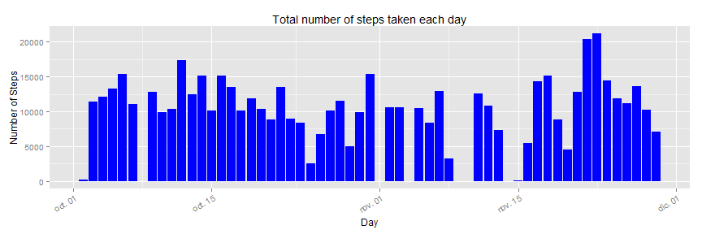
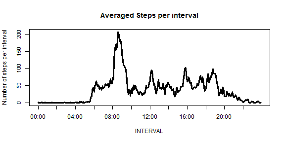
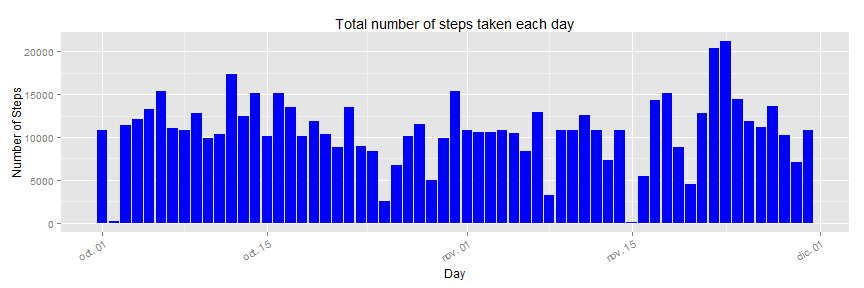
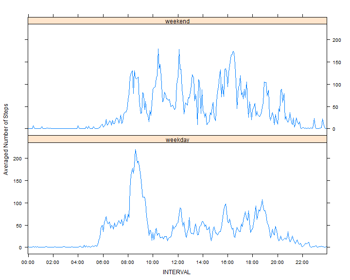

# Reproducible Research: Peer Assessment 1  

## Loading and preprocessing the data

*Show any code that is needed to:*

- **Load the data (i.e. read.csv())**


```r
data_directory <- "./data"
fileActivity <- file.path(data_directory,"activity.csv")

if (!file.exists(fileActivity)) {
    zipFile <- "activity.zip"
    unzip(zipFile, exdir=data_directory, overwrite = TRUE)
    dateZipDownloaded <- date()
}
```

Let's load the data into a data frame and take a look:


```r
df_activity <- read.csv(fileActivity)
dim(df_activity)
```

```
## [1] 17568     3
```

```r
head(df_activity)
```

```
##   steps       date interval
## 1    NA 2012-10-01        0
## 2    NA 2012-10-01        5
## 3    NA 2012-10-01       10
## 4    NA 2012-10-01       15
## 5    NA 2012-10-01       20
## 6    NA 2012-10-01       25
```

```r
tail(df_activity)
```

```
##       steps       date interval
## 17563    NA 2012-11-30     2330
## 17564    NA 2012-11-30     2335
## 17565    NA 2012-11-30     2340
## 17566    NA 2012-11-30     2345
## 17567    NA 2012-11-30     2350
## 17568    NA 2012-11-30     2355
```

```r
str(df_activity)
```

```
## 'data.frame':	17568 obs. of  3 variables:
##  $ steps   : int  NA NA NA NA NA NA NA NA NA NA ...
##  $ date    : Factor w/ 61 levels "2012-10-01","2012-10-02",..: 1 1 1 1 1 1 1 1 1 1 ...
##  $ interval: int  0 5 10 15 20 25 30 35 40 45 ...
```

- **Process/transform the data (if necessary) into a format suitable for your analysis**

"interval" appears to code time as an integer (i.e., "10:55" as 1055). Let's transform this column into a more suitable to print format:


```r
df_activity <- transform(df_activity, interval=factor(sprintf("%02d:%02d",interval/100,interval%%100)))
```

## What is mean total number of steps taken per day?
*For this part of the assignment, you can ignore the missing values in the dataset.*

- **Make a histogram of the total number of steps taken each day**


```r
if (!("ggplot2" %in% loadedNamespaces())) {
    if(!("ggplot2" %in% installed.packages()[,1])) {
        install.packages("ggplot2")
    }
}
library(ggplot2, quietly=TRUE)

ggplot(data=df_activity,aes(x=as.Date(date), y=steps)) + 
    geom_bar(stat="identity",  fill="blue") +
    guides(fill=FALSE) +  
    xlab("Day") + ylab("Number of Steps") +
    ggtitle("Total number of steps taken each day") +
    theme(axis.text.x = element_text(angle = 30, hjust = 1))
```

```
## Warning: Removed 2304 rows containing missing values (position_stack).
```



- **Calculate and report the mean and median total number of steps taken per day**

I'll take the opportunity for some work with dplyr:

```r
if (!("dplyr" %in% loadedNamespaces())) {
    if(!("dplyr" %in% installed.packages()[,1])) {
        install.packages("dplyr")
    }
}
library(dplyr, quietly=TRUE)
```

Let's make a swirl tbl from our data and group it by date in order to sum steps
in each day:

```r
tbl_df_activity <- tbl_df(df_activity)
tbl_activity_by_date <- group_by(tbl_df_activity,date)
sm <- summarize(tbl_activity_by_date,sum(steps))
names(sm)<-make.names(names(sm))
```

Calculating mean and media is easy now:


```r
mean(sm$sum.steps,na.rm = T)
```

```
## [1] 10766.19
```

```r
median(sm$sum.steps,na.rm = T)
```

```
## [1] 10765
```
## What is the average daily activity pattern?

- **Make a time series plot (i.e. type = "l") of the 5-minute interval (x-axis) and the average number of steps taken, averaged across all days (y-axis)**

Now I'll group data by interval and take the mean in each interval:


```r
tbl_activity_by_interval <- group_by(tbl_df_activity,interval)
sm <- summarize(tbl_activity_by_interval,mean(steps, na.rm=T))
names(sm)<-c("interval","steps")
```
And plot the time series:

```r
# labels each 4 hours
pos_labels = seq(1,length(sm$interval),length(sm$interval)/12)

plot(1:length(sm$interval),sm$steps,type="l", 
     ylim=c(0, max(sm$steps, na.rm=T)),
     xlab="INTERVAL", ylab="Number of steps per interval",
     xaxt = "n",
     main="Averaged Steps per interval",
     cex.axis = 0.9,
     lwd = 3)
axis(1, at = pos_labels, labels = as.character(sm$interval[pos_labels]))
```



- **Which 5-minute interval, on average across all the days in the dataset, contains the maximum number of steps?**


```r
sm[which(sm$steps == max(sm$steps)),]
```

```
## Source: local data frame [1 x 2]
## 
##   interval    steps
## 1    08:35 206.1698
```

## Imputing missing values

*Note that there are a number of days/intervals where there are missing values (coded as NA). The presence of missing days may introduce bias into some calculations or summaries of the data.*

- **Calculate and report the total number of missing values in the dataset (i.e. the total number of rows with NAs)**

These are the total number of missing values and the NAs % in the data set:


```r
sum(is.na(df_activity$steps))
```

```
## [1] 2304
```

```r
sprintf("%.01f %s",mean(is.na(df_activity$steps))*100,"%")
```

```
## [1] "13.1 %"
```

Anyway, let's check "date" and "interval" too:

```r
sum(is.na(df_activity$date))
```

```
## [1] 0
```


```r
sum(is.na(df_activity$interval))
```

```
## [1] 0
```

- **Devise a strategy for filling in all of the missing values in the dataset. The strategy does not need to be sophisticated. For example, you could use the mean/median for that day, or the mean for that 5-minute interval, etc.**

I'll use the mean for that 5-minute interval.

- **Create a new dataset that is equal to the original dataset but with the missing data filled in.**


```r
head(df_activity)
```

```
##   steps       date interval
## 1    NA 2012-10-01    00:00
## 2    NA 2012-10-01    00:05
## 3    NA 2012-10-01    00:10
## 4    NA 2012-10-01    00:15
## 5    NA 2012-10-01    00:20
## 6    NA 2012-10-01    00:25
```


```r
# Locate where (indexes) NAs are
indexNAs<-which(is.na(df_activity$steps))

# Create new dataset
new_df_activity<-df_activity

# Loop changing NAs in new dat frame by the mean for that 5-minute
# interval
sapply(indexNAs, changeNA <- function (x) {
    new_df_activity[x,"steps"] <<- 
        as.numeric(sm[sm$interval == new_df_activity[x, "interval"],"steps"])
  
})
```

Let's see if NAs heve been changed as I wanted:

```r
head(new_df_activity)
```

```
##       steps       date interval
## 1 1.7169811 2012-10-01    00:00
## 2 0.3396226 2012-10-01    00:05
## 3 0.1320755 2012-10-01    00:10
## 4 0.1509434 2012-10-01    00:15
## 5 0.0754717 2012-10-01    00:20
## 6 2.0943396 2012-10-01    00:25
```

```r
sum(is.na(new_df_activity$steps))
```

```
## [1] 0
```
It seems so!

- **Make a histogram of the total number of steps taken each day and Calculate and report the mean and median total number of steps taken per day. Do these values differ from the estimates from the first part of the assignment? What is the impact of imputing missing data on the estimates of the total daily number of steps?**


```r
ggplot(data=new_df_activity,aes(x=as.Date(date), y=steps,)) + 
    geom_bar(stat="identity",  fill="blue") +
    guides(fill=FALSE) + 
    xlab("Day") + ylab("Number of Steps") +
    ggtitle("Total number of steps taken each day")+
    theme(axis.text.x = element_text(angle = 30, hjust = 1))
```



Let's calculate mean and median again, now without NAs:

```r
tbl_df_activity <- tbl_df(new_df_activity)
tbl_activity_by_date <- group_by(tbl_df_activity,date)
sm <- summarize(tbl_activity_by_date,sum(steps))
names(sm)<-make.names(names(sm))
mean(sm$sum.steps)
```

```
## [1] 10766.19
```

```r
median(sm$sum.steps)
```

```
## [1] 10766.19
```
No big difference, indeed!

## Are there differences in activity patterns between weekdays and weekends?

*For this part the weekdays() function may be of some help here. Use the dataset with the filled-in missing values for this part.*

- **Create a new factor variable in the dataset with two levels – “weekday” and “weekend” indicating whether a given date is a weekday or weekend day.**

I'll take advantage of sapply() again, to loop the data frame.

```r
new_df_activity$kind <- factor(
    sapply(new_df_activity$date, 
           kind_of_day <- function(x){
               d<-strptime(as.Date(x,"%Y-%m-%d"), "%Y-%m-%d")
               if(weekdays(d) %in% c("sábado","domingo"))
                   print("weekend")
               else
                   print("weekday")
}))
```

Let's check it out:


```r
head(new_df_activity)
```

```
##       steps       date interval    kind
## 1 1.7169811 2012-10-01    00:00 weekday
## 2 0.3396226 2012-10-01    00:05 weekday
## 3 0.1320755 2012-10-01    00:10 weekday
## 4 0.1509434 2012-10-01    00:15 weekday
## 5 0.0754717 2012-10-01    00:20 weekday
## 6 2.0943396 2012-10-01    00:25 weekday
```

```r
tail(new_df_activity)
```

```
##           steps       date interval    kind
## 17563 2.6037736 2012-11-30    23:30 weekday
## 17564 4.6981132 2012-11-30    23:35 weekday
## 17565 3.3018868 2012-11-30    23:40 weekday
## 17566 0.6415094 2012-11-30    23:45 weekday
## 17567 0.2264151 2012-11-30    23:50 weekday
## 17568 1.0754717 2012-11-30    23:55 weekday
```

```r
str(new_df_activity)
```

```
## 'data.frame':	17568 obs. of  4 variables:
##  $ steps   : num  1.717 0.3396 0.1321 0.1509 0.0755 ...
##  $ date    : Factor w/ 61 levels "2012-10-01","2012-10-02",..: 1 1 1 1 1 1 1 1 1 1 ...
##  $ interval: Factor w/ 288 levels "00:00","00:05",..: 1 2 3 4 5 6 7 8 9 10 ...
##  $ kind    : Factor w/ 2 levels "weekday","weekend": 1 1 1 1 1 1 1 1 1 1 ...
```

- **Make a panel plot containing a time series plot (i.e. type = "l") of the 5-minute interval (x-axis) and the average number of steps taken, averaged across all weekday days or weekend days (y-axis). See the README file in the GitHub repository to see an example of what this plot should look like using simulated data.**

Let's use our new factor "kind" to make a 2 panel Lattice plot. 
  
Now we must group by "kind" and "interval":

```r
tbl_new_activity =tbl_df(new_df_activity)
new_activity_by_kind <- group_by(tbl_new_activity,kind,interval)
mn <- summarize(new_activity_by_kind,mean(steps))
names(mn)<-c("kind","interval","mean_steps")
```

And here's our pretty 2 panel plot:

```r
library(lattice)

# labels each 2 hours
pos_labels = seq(1,length(mn$interval),length(mn$interval)/24)

xyplot( mean_steps ~ interval | kind, data = mn, 
        type="l", layout = c(1, 2),
        xlab = "INTERVAL",
        ylab = "Averaged Number of Steps", 
        scales = list(x=list(at=pos_labels,
                             labels = as.character(df_activity[pos_labels,]$interval))))
```




